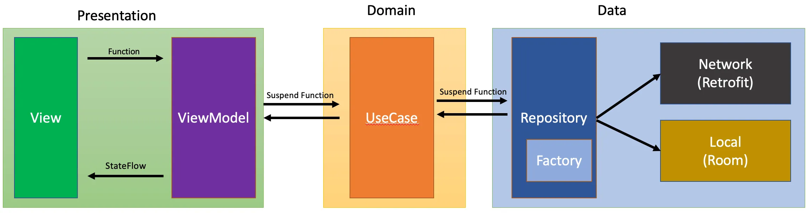

# 앱 아키텍처

MVVM 패턴을 도입 배경

일단 **MVC**의 경우에는 안드로이드에서 적용할 때 View와 Controller가 Activity에서 모두 처리되어야하기 때문에 Activity가 커지는 문제가 있어서 관심사의 분리가 비교적 원활하지 않다고 여겨졌습니다.

**MVP**는 Presenter가 뷰와 1대1로 동작하기 때문에 뷰와 프레젠터의 의존성이 강해지는 문제가 발생하고 이에 따라 종종 프레젠터의 로직이 비대해지는 문제가 발생하기도 했습니다.

MVI 방식도 고려하였으나 이번 프로젝트에 적용하기에는 코스트 낭비라던지, 개발 여건이 맞지 않을 것 같아 제외하기로 하였습니다.

따라서 **뷰와 모델의 관심사를 충분히 분리**할 수 있고, **화면회전 등의 동작으로 뷰가 다시 생성되어도 뷰모델을 통해 데이터를 유지**할 수 있는 **MVVM 방식**을 채택하기로 결정했습니다.&#x20;

* 테스트 용이성 : MVVM 아키텍처에서 각각의 모든 코드는 알갱이성(granular)을 유지합니다. 적절한 방법으로 구현되었다는 전제 하에, 모든 내부적, 외부적 의존성을 코어 로직을 포함한 코드로부터 유지합니다.
* 확장성 : 늘어나는 코드 알갱이 조각과 분리 경계로 인하여, 동시에 유지보수성을 얻게 된다.
* MVVM 패턴을 사용하는 가장 주요한 목적은 뷰를 추상화해서 비즈니스 로직 뒤에 있는 코드가 줄어들게 하여 운영 및 유지 보수 코스트를 낮추는 것입니다.
* 로직과 프레젠테이션 계층은 느슨하게 결합하도록 합니다.
* 어설픈 UI 자동화 도구 없이 테스트가 가능합니다.

<figure><figcaption>
MVVM + Clean Architecture
</figcaption></figure>

모듈 구조

&#x20;앱의 모듈 구조는 멀티 모듈 구조로 개발이 되어야 하며, 모듈을 구성하는 구성 요소는 기능적인 요소로 구분합니다. 이로 인해 모듈간의 의존성을 최소화 하여 아키텍처 적용에 용이하게 하며, DI (Dagger-Hilt) 적용으로 유연하게 개발 가능하도록 하게하고, 기능별 화면 구성으로 테스트를 용이하게 하기 위함입니다.

단위 기능으로 의미가 있고 여러 모듈에서 사용될만한 기능이라면 신규 모듈을 생성하는 것을 권장합니다.

신규 모듈 생성 시 모듈 디자인과 리뷰 과정을 선행해야 하며 이를 통해 디자인 문서를 생성합니다. 이후 작성한 디자인 문서를 바탕으로 적절한 레이어에 모듈을 생성하고, 기본 라이브러리, 버전, 배포, Proguard 설정을 작성합니다.

앱을 구성하는 모듈들은 아래와 같은 기능들을 모듈로 구성합니다.

<figure><figcaption>
다중 모듈 코드베이스의 종속 항목 그래프
</figcaption></figure>

* core&#x20;
  * 모든 모듈의 근간이 되는 코어 모듈
  * 코어 모듈은 다른 모듈들을 참조할 수 없으며, 앱의 리소스나 파일에 독립적으로 존재해야 합니다.
  * 코어 모듈은 /core 폴더 안에 생성
* smlg-android
  * 모듈의 근간이 되는 코어 기능이지만, 우리글로벌뱅크 앱에 종속적인 경우 사용되는 코어 모듈
  * core 모듈 계층과 기능들의 이어주는 역할을 제공합니다.
  * 모듈은 /smlg-android 폴더 안에 생성
* ui
  * 유저에게 보여지는 ui 컴퍼넌트 모듈 계층
  * 단위 기능인 피쳐 모듈의 ui 에 근간이 되는 모듈로, 스타일 및 테마에 대한 공통 UI 컴포넌트를 제공.
  * 비지니스 로직은 포함되지 않아야 하며, 피쳐 모듈은 이 모듈 계층을 이용하여 기본 UI 를 제공합니다.
  * UI 모듈은 /ui 폴더 안에 생성
* feature
  * 유저가 사용하는 단위 기능을 제공하는 모듈 계층.
  * 기능별로 비지니스 로직을 포함하고 있으며 직접 구현 혹은 라이브러리 모듈을 사용하여 구현하며, DI 적용으로 유연하게 개발이 가능하도록 합니다.
  * 피쳐 모듈은 다른 피쳐 모듈과 라이브러리 모듈을 참조 할 수 있다. 일반적인 경우 동일 레이어 모듈 간에는 참조를 권하지 않으며, 참조를 해야 하는 경우 순환 참조가 일어나지 않도록 주의해 주세요.
  * 피쳐 모듈은 `/feature` 폴더 안에 생성.
* app
  * 일반적인 application / sdk 를 구성하는 모듈 계층.
  * 시스템의 최상위에서 각 모듈의 디펜던시와 조립을 담당하며 비지니스 로직은 포함하지 않습니다.
  * 앱 모듈은 피쳐 모듈과 라이브러리 모듈의 접근 권한을 갖고 있으며, 시스템 전체 의존성 주입을 관리.
  * 앱 모듈은 `/app` 폴더 안에 생성.
* library
  * 여러 피쳐 모듈에서 재사용하는 단위 로직을 분리하여 라이브러리 모듈로 구성.
  * 피쳐 모듈과 라이브러리 모듈의 구분은 정확히 규칙을 정의하기에 모호한 경우가 있지만, 일반적으로 유저 관점에서의 기능인지를 주요 구분 팩터로 구분합니다.
  * 라이브러리 모듈은 다른 라이브러리 모듈을 참조 할 수 있습니다.&#x20;
  * 일반적인 경우 동일 레이어 모듈 간에는 참조를 권하지 않으며, 참조를 해야 하는 경우 순환 참조가 일어나지 않도록 주의해야 합니다.
  * 라이브러리 모듈은 `/lib` 폴더 안에 생성.

기능(feature) 모듈의 내부 패키지 구성도 입니다.

Module

* ui
  * view
  * viewmodel
* domain
* data
* di

모듈의 세부 요소들은 아래와 같이 패키지가 구성되어야 합니다.&#x20;

* 화면에 애플리케이션 데이터를 표시하는 _UI 레이어_
* 앱의 비즈니스 로직을 포함하고 애플리케이션 데이터를 노출하는 _데이터 레이어_
* UI와 데이터 레이어 간의 상호작용을 간소화하고 재사용하기 위한 _도메인 레이어_

